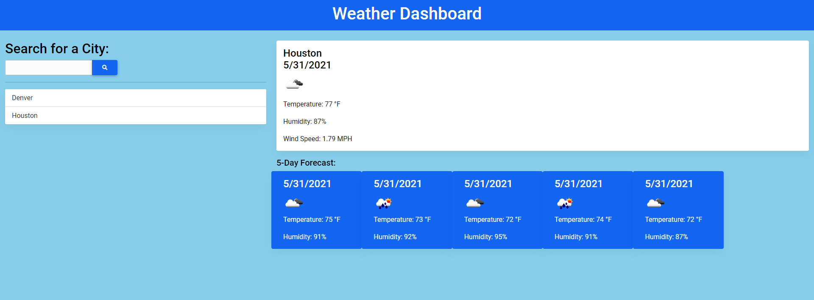

# Weather Dashboard App

A weather dashboard with search functionality to find current weather conditions and the future weather outlook for multiple cities.

## Preview

## Purpose
Build my first app using an API. Retrieve data from a third-party weather API (OpenWeather API) and using it in context.

## Functionality
Build a weather dashboard application with search functionality to find current weather conditions and the future weather outlook for multiple cities.

[See what I can do](https://jefarth.github.io/Weather-Dashboard/)

***
### Technologies Used
* JavaScript
* OpenWeather API
* HTML
* CSS